# UV and Nix Installation Optimization Flow

## Complete Flow Diagram with Checkpoints and Troubleshooting


## Security Architecture Diagram

```mermaid
flowchart TB
    subgraph "Security Layers"
        Layer1[🔒 Layer 1: Container Runtime Security]
        Layer2[🔒 Layer 2: Pod Security Context]
        Layer3[🔒 Layer 3: Network Security]
        Layer4[🔒 Layer 4: Filesystem Security]
        Layer5[🔒 Layer 5: Application Security]
    end
    
    Layer1 --> ContainerdCheck["containerd >= 2.0.0 - Required for nix-portable"]
    ContainerdCheck --> ContainerdOK2{Version OK?}
    ContainerdOK2 -->|No| SecurityFail1["❌ SECURITY BLOCK: Upgrade containerd"]
    ContainerdOK2 -->|Yes| Layer2
    
    Layer2 --> PodSec["Pod Security Context - Uses proot - no special caps needed"]
    PodSec --> CapCheck{Has CAP_SYS_ADMIN?}
    CapCheck -->|Required| SecurityFail2["❌ SECURITY RISK: Avoid if possible"]
    CapCheck -->|Not Required| Layer3
    
    Layer3 --> NetPol["Network Policies - Allow: cache.nixos.org, github.com, PyPI"]
    NetPol --> NetCheck{Network Accessible?}
    NetCheck -->|No| SecurityFail3["❌ NETWORK BLOCK: Configure policies"]
    NetCheck -->|Yes| Layer4
    
    Layer4 --> FSPerms["Filesystem Permissions - PVC supports POSIX permissions"]
    FSPerms --> FSCheck{Supports Permissions?}
    FSCheck -->|No| SecurityFail4["❌ FILESYSTEM LIMIT: Use compatible FS"]
    FSCheck -->|Yes| Layer5
    
    Layer5 --> AppSec["Application Security - Isolated containers - Read-only base - Writable only in /tmp + volumes"]
    AppSec --> SecurityOK[✅ All Security Checks Pass]
    
    style ContainerdCheck fill:#ffeb3b,stroke:#f57f17,stroke-width:3px
    style PodSec fill:#e3f2fd,stroke:#1976d2,stroke-width:2px
    style NetPol fill:#e3f2fd,stroke:#1976d2,stroke-width:2px
    style FSPerms fill:#e3f2fd,stroke:#1976d2,stroke-width:2px
    style AppSec fill:#e3f2fd,stroke:#1976d2,stroke-width:2px
    style SecurityFail1 fill:#f44336,stroke:#c62828,stroke-width:2px
    style SecurityFail2 fill:#f44336,stroke:#c62828,stroke-width:2px
    style SecurityFail3 fill:#f44336,stroke:#c62828,stroke-width:2px
    style SecurityFail4 fill:#f44336,stroke:#c62828,stroke-width:2px
    style SecurityOK fill:#4caf50,stroke:#2e7d32,stroke-width:3px
```



## Security Checkpoints and Considerations

### 🔒 Critical Security Checkpoints

#### 1. **Containerd Version Check** (CRITICAL)
- **Checkpoint**: Before nix-portable initialization
- **Requirement**: containerd >= 2.0.0
- **Why**: Older versions have stricter security contexts that block nix-portable operations
- **Check Command**: `kubectl get nodes -o jsonpath='{.items[0].status.nodeInfo.containerRuntimeVersion}'`
- **Fix**: Upgrade kind and recreate cluster

#### 2. **PVC Filesystem Permissions**
- **Checkpoint**: Before writing to Nix store
- **Requirement**: Filesystem must support POSIX permissions
- **Why**: Nix needs to set file permissions for packages
- **Issue**: Some network filesystems (NFS) may not support all permission operations
- **Check**: `test -w ~/.nix-portable/nix/store`
- **Fix**: Use local filesystem or compatible network filesystem

#### 3. **Pod Security Context**
- **Checkpoint**: Before nix-portable execution
- **Requirement**: Sufficient permissions for proot/bubblewrap
- **Why**: nix-portable uses proot (no special capabilities) or bubblewrap (requires CAP_SYS_ADMIN)
- **Current**: Uses proot (no special capabilities needed)
- **Check**: Verify no restrictive security policies

#### 4. **Network Security Policies**
- **Checkpoint**: Before downloading packages
- **Requirement**: Access to cache.nixos.org and github.com
- **Why**: nix-portable needs to download packages and evaluate nixpkgs
- **Check**: `curl -I https://cache.nixos.org`
- **Fix**: Configure network policies to allow access

### 🔧 nix-portable-base Security Considerations

#### Container Image Security
- **Base Image**: `python:3.11-slim` (official, regularly updated)
- **nix-portable**: Downloaded from GitHub releases (verify checksums)
- **uv**: Installed via pip (from PyPI)
- **Recommendation**: Pin versions and verify checksums

#### Runtime Security
- **Isolation**: Each workflow runs in isolated container
- **Cache Isolation**: Shared PVCs but isolated execution environments
- **Network**: Only required external access (cache.nixos.org, github.com, PyPI)
- **File System**: Read-only base image, writable only in /tmp and mounted volumes

#### Capabilities
- **Current**: No special capabilities required (uses proot)
- **Alternative**: Could use bubblewrap with CAP_SYS_ADMIN (more secure but requires privileges)
- **Recommendation**: Stick with proot for security

## Detailed Checkpoint Descriptions

### Checkpoint 1: Base Image Verification
**Location**: Start of workflow execution  
**Check**: `command -v nix-portable && command -v uv`  
**Failure**: Workflow fails immediately  
**Fix**: Use `nix-portable-base:latest` image

### Checkpoint 2: PVC Binding
**Location**: Before mounting volumes  
**Check**: `kubectl get pvc -n argo`  
**Failure**: Workflow fails if PVCs not bound  
**Fix**: Create PVCs: `kubectl apply -f infrastructure/k8s/pvc-cache-volumes.yaml`

### Checkpoint 3: Containerd Version (SECURITY)
**Location**: Before nix-portable initialization  
**Check**: `kubectl get nodes -o jsonpath='{.items[0].status.nodeInfo.containerRuntimeVersion}'`  
**Requirement**: `containerd://2.0.0` or newer  
**Failure**: nix-portable will fail with "unable to build packages"  
**Fix**: `make preflight` → upgrade kind → recreate cluster

### Checkpoint 4: NP_STORE Configuration
**Location**: Before nix-portable commands  
**Check**: `echo $NP_STORE` (should be `/root/.nix-portable/nix/store`)  
**Failure**: nix-portable won't know where to store packages  
**Fix**: Script automatically sets NP_STORE if not set

### Checkpoint 5: Disk Space
**Location**: Before downloading packages  
**Check**: `df -h ~/.nix-portable/nix/store` (need >= 1GB)  
**Failure**: Package downloads will fail  
**Fix**: Increase PVC size or clean old packages

### Checkpoint 6: Nix Database
**Location**: Before using nix-portable  
**Check**: `test -f ~/.nix-portable/nix/store/.nix-db/db.sqlite`  
**Failure**: nix-portable can't track packages  
**Fix**: Script automatically creates database on first run

### Checkpoint 7: Network Connectivity
**Location**: Before downloading packages  
**Check**: `curl -I https://cache.nixos.org && curl -I https://github.com`  
**Failure**: Packages can't be downloaded  
**Fix**: Check network policies, DNS, firewall rules

### Checkpoint 8: nix-portable Functionality
**Location**: Before installing system dependencies  
**Check**: `nix-portable nix --version` (should return version)  
**Failure**: "Fatal error: nix is unable to build packages"  
**Fix**: Check containerd version, PVC permissions, security context

### Checkpoint 9: nix-shell Execution
**Location**: During system dependency installation  
**Check**: `nix-portable nix-shell -p package --run 'command'`  
**Failure**: Package installation fails  
**Fix**: Verify package names, network access, database exists

### Checkpoint 10: UV Cache Setup
**Location**: Before Python package installation  
**Check**: `test -d /root/.cache/uv && test -w /root/.cache/uv`  
**Failure**: UV can't cache packages  
**Fix**: Script automatically creates directory

### Checkpoint 11: Python Package Installation
**Location**: During dependency installation  
**Check**: `uv pip install package` exit code  
**Failure**: Packages can't be installed  
**Fix**: Check package names, network access, UV cache permissions

## Troubleshooting Guide

### Issue: "nix-portable not found"
**Symptoms**: Error at start of workflow  
**Causes**: Wrong base image  
**Solution**: Use `nix-portable-base:latest` image  
**Prevention**: Verify image in workflow template

### Issue: "PVC not bound"
**Symptoms**: Workflow fails immediately  
**Causes**: PVCs not created or storage unavailable  
**Solution**: 
```bash
kubectl apply -f infrastructure/k8s/pv-cache-volumes.yaml
kubectl apply -f infrastructure/k8s/pvc-cache-volumes.yaml
kubectl get pvc -n argo  # Verify bound
```

### Issue: "containerd version too old"
**Symptoms**: nix-portable fails with "unable to build packages"  
**Causes**: containerd < 2.0.0  
**Solution**:
```bash
make preflight  # Check version
brew upgrade kind
kind delete cluster --name argo-dev
make cluster-up
make check-containerd  # Verify
```

### Issue: "Insufficient disk space"
**Symptoms**: Package downloads fail  
**Causes**: PVC is full  
**Solution**:
```bash
# Check usage
make nix-store-info

# Clean store
make clean-nix-store

# Or increase PVC size in pv-cache-volumes.yaml
```

### Issue: "Network connectivity failed"
**Symptoms**: Can't download packages  
**Causes**: Network policies, DNS, firewall  
**Solution**:
```bash
# Test from pod
kubectl run -it --rm test --image=curlimages/curl --restart=Never -- curl -I https://cache.nixos.org

# Check network policies
kubectl get networkpolicies -n argo

# Check DNS
kubectl run -it --rm test --image=busybox --restart=Never -- nslookup cache.nixos.org
```

### Issue: "nix-portable initialization failed"
**Symptoms**: "Fatal error: nix is unable to build packages"  
**Causes**: Multiple possible (see checklist below)  
**Solution Checklist**:
1. ✅ containerd >= 2.0.0? (`make check-containerd`)
2. ✅ NP_STORE set? (`echo $NP_STORE`)
3. ✅ Database directory writable? (`test -w ~/.nix-portable/nix/var/nix/db`)
4. ✅ PVC filesystem supports permissions? (check filesystem type)
5. ✅ Network accessible? (`curl -I https://cache.nixos.org`)
6. ✅ Disk space available? (`df -h ~/.nix-portable/nix/store`)

### Issue: "nix-shell failed"
**Symptoms**: System dependencies not installed  
**Causes**: Package name wrong, network issue, database missing  
**Solution**:
```bash
# Check package name (e.g., 'make' → 'gnumake')
# Search: https://search.nixos.org/packages

# Verify network
curl -I https://cache.nixos.org

# Check database
ls -lh ~/.nix-portable/nix/store/.nix-db/db.sqlite
```

### Issue: "Python packages installation failed"
**Symptoms**: uv pip install fails  
**Causes**: Package name/version wrong, network issue, cache permissions  
**Solution**:
```bash
# Try without cache
uv pip install --no-cache package

# Check cache permissions
ls -ld /root/.cache/uv

# Verify network
curl -I https://pypi.org
```

## Performance Optimization Checkpoints

### Cache Hit Verification
- **UV Cache**: Check `[UV CACHE] ✓ package found in LOCAL CACHE`
- **Nix Store**: Check `[NIX CACHE] Found X packages in store`
- **Expected**: 70-90% cache hit rate after first run

### Cold Start Optimization
- **First Run**: Downloads packages, creates database (~15-75s)
- **Subsequent Runs**: Uses cache (~4-10s)
- **Monitor**: Track cache hit rates and cold start times

## Monitoring and Alerts

### Key Metrics to Monitor
1. **Containerd Version**: Alert if < 2.0.0
2. **PVC Usage**: Alert if > 80% full
3. **Cache Hit Rate**: Track UV and Nix cache effectiveness
4. **Cold Start Time**: Monitor improvement from caching
5. **Network Failures**: Track connectivity issues
6. **nix-portable Failures**: Track initialization failures

### Recommended Alerts
- ⚠️ **Warning**: PVC usage > 70%
- 🚨 **Critical**: containerd version < 2.0.0
- 🚨 **Critical**: Cache hit rate < 50% (after warm-up period)
- ⚠️ **Warning**: Network connectivity failures > 5% of workflows

## Quick Reference: Common Issues and Solutions

### 🔴 Critical Issues (Workflow Fails Immediately)

| Issue | Symptom | Quick Fix |
|-------|---------|-----------|
| **Wrong base image** | "nix-portable not found" | Use `nix-portable-base:latest` |
| **PVC not bound** | "PVC not found" | `kubectl apply -f infrastructure/k8s/pvc-cache-volumes.yaml` |
| **containerd too old** | "unable to build packages" | `make preflight` → upgrade kind → recreate cluster |
| **No disk space** | "Insufficient disk space" | `make clean-nix-store` or increase PVC size |

### 🟡 Warning Issues (May Work But Slow/Unreliable)

| Issue | Symptom | Quick Fix |
|-------|---------|-----------|
| **Network blocked** | Can't download packages | Check network policies, DNS, firewall |
| **Database missing** | Packages not recognized | Database auto-created on first run |
| **Cache not working** | Slow installs every time | Check PVC mounts, permissions |
| **Package name wrong** | "undefined variable" | Check: https://search.nixos.org/packages |

### 🟢 Optimization Issues (Works But Could Be Better)

| Issue | Symptom | Quick Fix |
|-------|---------|-----------|
| **Low cache hit rate** | Packages downloaded every time | Check cache size, common packages |
| **Slow cold starts** | First run always slow | Expected - subsequent runs use cache |
| **Large PVC usage** | Storage filling up | Clean old packages: `make clean-nix-store` |

## nix-portable-base Security Best Practices

### ✅ Recommended Security Settings

1. **Use proot runtime** (default, no special capabilities)
   - ✅ No CAP_SYS_ADMIN required
   - ✅ Works in restricted environments
   - ✅ Good security posture

2. **Read-only base image**
   - ✅ Base image is immutable
   - ✅ Only /tmp and mounted volumes are writable
   - ✅ Reduces attack surface

3. **Isolated containers**
   - ✅ Each workflow runs in separate container
   - ✅ No shared process namespace
   - ✅ Network isolation

4. **Minimal network access**
   - ✅ Only required endpoints: cache.nixos.org, github.com, PyPI
   - ✅ Use network policies to restrict
   - ✅ No outbound access to arbitrary hosts

5. **PVC access control**
   - ✅ PVCs are namespace-scoped
   - ✅ Use RBAC to control access
   - ✅ Monitor PVC usage

### ⚠️ Security Considerations

1. **Shared PVCs**
   - ⚠️ Multiple pods share same cache
   - ⚠️ Potential for cache poisoning (mitigated by isolated execution)
   - ✅ Solution: Use separate PVCs per tenant if needed

2. **Package verification**
   - ⚠️ Packages downloaded from cache.nixos.org
   - ✅ Nix uses cryptographic hashes for verification
   - ✅ Packages are content-addressed (immutable)

3. **Container escape**
   - ⚠️ nix-portable uses proot (user-space virtualization)
   - ✅ Proot is safer than bubblewrap (no kernel capabilities)
   - ✅ Still runs in container (additional isolation layer)

4. **Supply chain security**
   - ⚠️ Packages come from nixpkgs (community-maintained)
   - ✅ Nix ensures reproducible builds
   - ✅ Consider pinning nixpkgs version for stability

## Verification Commands

### Pre-flight Checks
```bash
# Run all pre-flight checks
make preflight

# Check containerd version specifically
make check-containerd

# Full diagnostics
./diagnose-nix-portable.sh
```

### Runtime Checks (from inside pod)
```bash
# Check nix-portable
nix-portable nix --version

# Check UV
uv --version

# Check cache status
ls -lh /root/.cache/uv
ls -lh /root/.nix-portable/nix/store

# Check disk space
df -h /root/.nix-portable/nix/store

# Check network
curl -I https://cache.nixos.org
curl -I https://github.com
```

### Post-execution Verification
```bash
# Check cache hit rates (from logs)
grep "\[UV CACHE\]" <workflow-logs>
grep "\[NIX CACHE\]" <workflow-logs>

# Check PVC usage
make nix-store-info

# Check workflow success
argo get <workflow-name>
```
